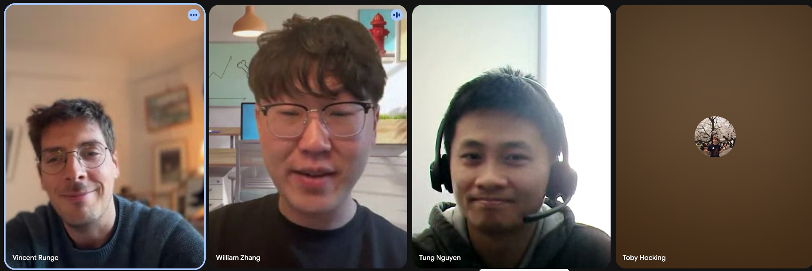

This site is the public write-up of my **Google Summer of Code (GSoC) 2026** work on
[**gfpop**](https://github.com/vrunge/gfpop). It does two things:

1. **Contribution log** — posts about changes I make to gfpop, each linking the upstream
   pull request it describes.
2. **Documentation / tutorials** for using gfpop, with runnable R examples.

Click [Home](index.qmd) in the top navigation to read the posts.

## What is gfpop?

**gfpop** = *Graph-constrained Functional Pruning Optimal Partitioning* — an R package
with a C++ core for **multiple change-point detection under graph constraints**, by
Vincent Runge (LaMME, Université d'Évry).

You detect change-points in a 1-D signal, but constrain *how* the segment means may
change by defining a **graph** of states and edges. That single dynamic-programming
engine then expresses isotonic regression, up/down patterns, exponential decay, robust
fits, a fixed number of segments, and more.

- Upstream repo: <https://github.com/vrunge/gfpop>
- Method paper: <https://arxiv.org/abs/2002.03646>
- Install: `devtools::install_github("vrunge/gfpop")`

## About me

Maintained by [williamzhang7792](https://github.com/williamzhang7792). I contribute to
the upstream gfpop package via the usual fork-and-PR flow; this repo is the standalone
public record of that work.

