The midterm deliverable for my GSoC project is the core feature: it makes the constraint graph vary along the signal, so which edges are allowed depends on where you are in the data. The question here is narrower and more practical: once you have built something that size, how do you hand it to a maintainer?

Not as one diff. A single pull request that adds an R argument, threads it through the C++ solver, changes the dynamic-programming loops, and lands a new validated model is a request the reviewer cannot actually review. They can skim it, trust it, and merge it, or they can refuse it. Neither is what you want. What you want is for the maintainer to read each piece, agree with it on its own terms, and merge it while the rest is still on your fork.

So the work is five pull requests, A through E. Each one is small enough to read in a sitting, backward compatible by construction, and mergeable on its own. The trunk stays green from the first to the last. The opener is deliberately boring. The payoff at the end is an oracle test.

## The five PRs

**PR A, CI.** A GitHub Actions `R-CMD-check` workflow across Ubuntu, macOS, and Windows. This is the dull one on purpose, the foundation everything else stands on: a neutral reader that checks the package on three machines that are not mine, on every push. It earned its own write-up, [the first neutral reader](../adding-ci/), because turning it on surfaced a network install hiding inside the test suite and the fix was in the package, not the YAML. Fully independent of the rest. Open upstream as [#20](https://github.com/vrunge/gfpop/pull/20).

**PR B, the R rule API.** This adds a backward-compatible `rule` column to `Edge()`, and carries it through `graph()`, `StartEnd()`, and `Node()`. The default is `NA`, which means an edge is active in every rule, so a graph written today behaves exactly as it did before. Pure R, and no behavior change yet: the column is recorded and ignored. It is its own PR because the API shape is the part most worth arguing about before any code depends on it, so it goes up as a draft, [#21](https://github.com/vrunge/gfpop/pull/21), to invite that argument early.

**PR C, the inert C++ plumbing.** This adds the `ruleID` field to the C++ edge representation, a getter, a `Graph::isActive()` helper, and a defensive read of the new rule column out of the R graph. Nothing consumes any of it yet, so every result is bit-for-bit what it was before. It is backward compatible by construction, and an inert-equality test proves it. Splitting the plumbing from the activation means the reviewer can confirm the new machinery is genuinely dormant before they look at the switch that turns it on. Independent of B in principle, stacked on it in practice, for a reason I will get to.

**PR D, activation.** This is the behavioral switch. It threads a per-data-point rule vector through `gfpop()` and into the solver, and skips inactive edges inside the dynamic-programming loops. Before D, the rule column is a passenger; after D, it steers. It depends on B for the API and C for the C++ scaffolding. This is also where the work was expected to be hard, and the honest note below is about why it was not.

**PR E, the LOPART oracle.** The midterm payoff. It builds the four-rule, two-state graph that expresses LOPART, constructs the rule vector from a set of labels, and then asserts that gfpop with the `rule` argument reproduces `LOPART::LOPART()` exactly: the same change-points, the same segment means, the same loss. It depends on D, because it is the first thing that runs the whole chain end to end and checks the answer against an independent implementation.

## How they depend on each other

A, B, and C are independent. Each one can be built straight off `master` without the other two. D needs B and C. E needs D.

The true shape is a diamond, but in practice I built it as a straight line, A then B then C then D then E. The reason is small and concrete. C's inert-equality test is cleaner when it can use B's new `Edge(rule = ...)` API to construct its test graph, rather than reaching around it. Stacking C on B costs nothing, since D needs both anyway, and a linear stack is far simpler to keep green than a diamond you have to merge back together. When the difference between the honest dependency graph and the build order is one convenience edge, take the simpler build order.

## What's hard

PR D was supposed to be the hard one. The proposal called out infinity handling in the constraint operators as the risk: when an edge is switched off, the cost of taking it has to become infinite in a way the operators downstream handle without breaking, and I expected to be editing the `min`-cost operators one by one to make that true.

I did not have to touch them. The solver already initializes unreachable states to positive infinity, and the whole functional-pruning machinery is already built to propagate that correctly. Skipping an inactive edge is, as far as the operators are concerned, the same as never having had a path to it, which is a case they have always handled. The part I had budgeted the most worry for turned out to be free. That happens sometimes, and it is worth saying plainly rather than dressing it up as foresight.

## Why A through E is the midterm

The slicing is not arbitrary. A through E is exactly the set of "core goals, must deliver" from my [proposal](https://github.com/williamzhang7792/gsoc2026-gfpop-proposal-william-zhang/blob/main/proposal.Rmd), which is what makes it a natural milestone rather than a place I stopped because the clock ran out.

The mapping is one to one:

- `Edge(..., rule = ...)`, backward compatible: PR B.
- `gfpop(..., rule = ...)`, backward compatible: PR D.
- C++ edge filtering by rule: PR D.
- Infinity handling in the constraint operators: PR D, satisfied by reusing the existing machinery (the surprise above).
- A LOPART model, oracle-validated against `LOPART::LOPART()`: PR E.
- Regression tests, gfpop with no rule identical to current behavior: PR B, C, and D each carry their own.
- `R CMD check` passes with no new warnings: PR A, and held by all of them.

Every must-deliver box is checked. The stretch goals are deliberately Part 2: the up-down-with-labels model on synthetic genomic data, the performance benchmarks from a thousand points up to a million, and the capstone vignette with a filmstrip view of the graph changing along the signal. Those are real and they are next; they are just not what the midterm is for.

## Where it stands

A and B are open upstream: [#20](https://github.com/vrunge/gfpop/pull/20) is the CI workflow, and [#21](https://github.com/vrunge/gfpop/pull/21) is the rule API, sitting as a draft so the shape can be discussed before C, D, and E lean on it. C, D, and E are staged on my fork and will become their own PRs once the API in B has settled, since opening them now would only ask the maintainer to review against a moving target.

The whole stack is assembled and green on a [prototype branch](https://github.com/williamzhang7792/gfpop/tree/prototype/time-dependent-constraints), the LOPART oracle included. That branch is the proof that the diamond closes. The PRs are how I hand it over one honest piece at a time.

## Related PRs

This post is the hub for the series; each PR gets its own write-up as it goes upstream.

- PR A, CI: [PR #20](https://github.com/vrunge/gfpop/pull/20). Write-up: [the first neutral reader](../adding-ci/).
- PR B, the R rule API: [PR #21](https://github.com/vrunge/gfpop/pull/21), open as a draft.
- PR C, inert C++ plumbing: staged on the [prototype branch](https://github.com/williamzhang7792/gfpop/tree/prototype/time-dependent-constraints), PR to follow once B settles.
- PR D, activation: staged on the [prototype branch](https://github.com/williamzhang7792/gfpop/tree/prototype/time-dependent-constraints), PR to follow.
- PR E, the LOPART oracle: staged on the [prototype branch](https://github.com/williamzhang7792/gfpop/tree/prototype/time-dependent-constraints), PR to follow.
