## The project

This blog tracks my Google Summer of Code 2026 work on gfpop, an R package with a C++ core that detects change-points in a signal under graph constraints. The idea is to describe the allowed shape of a segmentation as a graph of states and edges, and let one dynamic-programming engine fit isotonic, up-down, and other patterns through that single interface. One engine, many shapes.

My project is **Time-Dependent Constraints in gfpop**. Today that graph is fixed in time: the same edges apply at every data point. That rules out any model whose allowed transitions change along the signal. LOPART is the example I keep coming back to, where what is permitted depends on whether a point falls inside a labeled region. The project adds a rule function that picks which edges are active at each time step, so the constraint graph can vary across the data instead of standing still.

The concrete work is a `rule=` argument on `Edge()` and `gfpop()`, the C++ edge filtering that backs it, and two validation models: LOPART, checked against the standalone LOPART package, and an up-down-with-labels model on synthetic genomic data. Two constraints sit underneath all of it. The argument stays backward compatible, and regression tests prove gfpop without `rule` returns exactly what it does today, down to the value. A capstone vignette ties it together.

The full write-up and timeline are in the proposal: [Time-Dependent Constraints in gfpop](https://github.com/williamzhang7792/gsoc2026-gfpop-proposal-william-zhang/blob/main/proposal.Rmd).

## How this blog is structured

The blog has two jobs.

The first is a **contribution log**. Each time I change something in gfpop upstream, a post here explains what changed and why, and links the pull request it came from. Those posts close with a short **Related PRs** section listing the upstream PR as a plain link like `[PR #123](https://github.com/vrunge/gfpop/pull/123)`, so the code and the write-up always point back at each other.

The second is **tutorials**: posts that show how to use gfpop, with runnable R. The site is built with Quarto, which runs the code in a post at render time. So the output and plots you see are produced by gfpop, not pasted in by hand.

Each post lives in its own folder under `posts/`. There are no upstream PRs yet, so this first post has no Related PRs section.

Every contribution post after it will.
